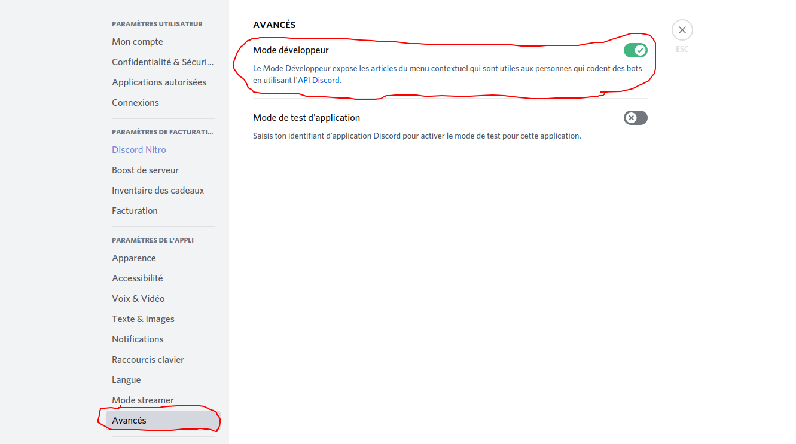

# À quoi sert et comment activer le mode développeur ?

## À quoi sert le mode "développeur" sur Discord ?

Le mode développeur sur Discord permet principalement **d'avoir accès aux IDs** des salons, serveurs, utilisateurs, etc... Il est donc très pratique pour les développeurs de bot privés par exemple, pour pouvoir accéder à un salon facilement et non pas à avoir de trouver manuellement le salon avec d'autres critères, le nom par exemple.

## Comment activer le mode "développeur" sur Discord ?

Pour activer ce fameux mode, il faut aller dans les paramètres de votre compte, "Avancés" et activer la case "Mode développeur".


Et voila ! Vous savez maintenant ce que c'est le mode "développeur" sur Discord et comment l'activer !


