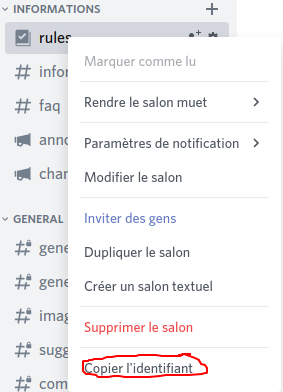

# Avoir l'id d'un salon Discord


Attention : merci de lire la page "[Qu'est-ce qu'un ID ?](https://my.hyxfr-docs.ga/avance-de-discord/menu-id/what-is-id)" et d'[activer le mode développeur](https://my.hyxfr-docs.ga/avance-de-discord/menu-discord-api/what-is-and-how-enable-developer-mode#how-enable) avec cette page : ["À quoi sert et comment activer le mode développeur"](https://my.hyxfr-docs.ga/avance-de-discord/menu-discord-api/what-is-and-how-enable-developer-mode) avant de lire cette page, Merci !


## Avoir l'id d'un salon Discord 

Pour avoir l'id d'un salon Discord, rien de plus simple, une fois le mode développeur activé, faites clique droit sur le salon en question et "Copier l'identifiant". Votre identifiant sera copié dans votre presse-papier !

