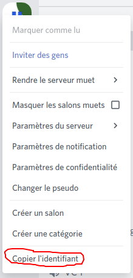

# Avoir l'id d'un serveur Discord


Attention : merci de lire la page "[Qu'est-ce qu'un ID ?](https://my.hyxfr-docs.ga/avance-de-discord/menu-id/what-is-id)" et d'[activer le mode développeur](https://my.hyxfr-docs.ga/avance-de-discord/menu-discord-api/what-is-and-how-enable-developer-mode#how-enable) avec cette page : ["À quoi sert et comment activer le mode développeur"](https://my.hyxfr-docs.ga/avance-de-discord/menu-discord-api/what-is-and-how-enable-developer-mode) avant de lire cette page, Merci !


## Avoir l'id d'un serveur Discord 

Quand le mode développeur est activé, on peut avoir l'id d'un serveur Discord, pour se faire, faites un clique droit sur le serveur en question et cliquez sur "Copier l'identifiant", l'identifiant sera copié dans votre presse-papier !

