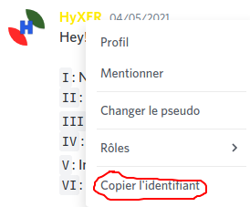
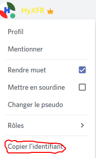
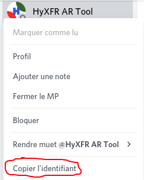
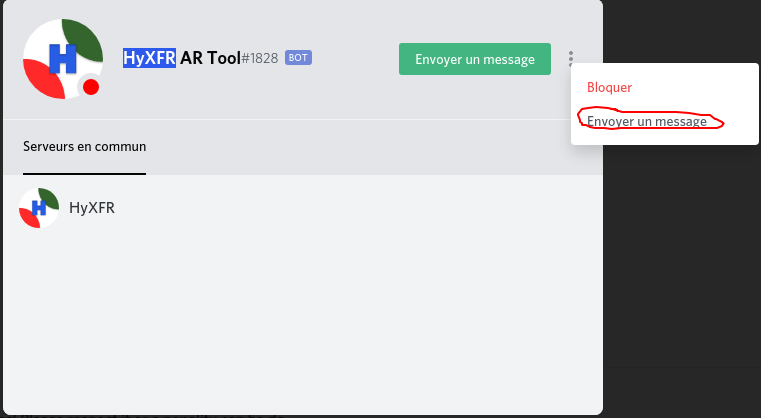

# Avoir l'id d'un utilisateur Discord


Attention : merci de lire la page "[Qu'est-ce qu'un ID ?](https://my.hyxfr-docs.ga/avance-de-discord/menu-id/what-is-id)" et d'[activer le mode développeur](https://my.hyxfr-docs.ga/avance-de-discord/menu-discord-api/what-is-and-how-enable-developer-mode#how-enable) avec cette page : ["À quoi sert et comment activer le mode développeur"](https://my.hyxfr-docs.ga/avance-de-discord/menu-discord-api/what-is-and-how-enable-developer-mode) avant de lire cette page, Merci !


## Avoir l'id d'un utilisateur Discord 

Étant un membre du réseau social Discord depuis quelques années, j'ai très rapidement remarqué qu'avoir un nom d'utilisateur & "délimitateur" _\(ex : HyXFR\#1231\)_ n'était pas suffisant pour pouvoir s'y reconnaître, une fois le mode développeur activé, vous pouvez obtenir l'id d'une personne très facilement, mais, il existe plusieurs techniques pour l'obtenir.

### Obtenir l'id via un message posté 

Pour obtenir l'id d'une personne avec un message qu'il a posté, rien de plus simple, faites un clique droit sur sa photo de profil ou sur son pseudo et cliquez sur "Copier l'identifiant"

### Obtenir l'id via la liste des membres du serveur 

Obtenir l'id de la personne via la liste des membres ressemble beaucoup à la précédente méthode, il suffit de faire un clique droit sur son nom d'utilisateur ou sur son image de profil et cliquer sur "Copier l'identifiant"

### Obtenir l'id via vos conversations privés 

Sur l’accueil de Discord \([https://discord.com/channels/@me](https://discord.com/channels/@me)\), il y a toutes vos conversations ouvertes sous le message "Messages privés", vous pouvez obtenir un ID via ça, il suffit de faire un clique droit sur la conversation avec la personne où vous voulez avoir son ID et cliquez sur "Copier l'identifiant".


Attention : ne confondez pas un **utilisateur** avec un **groupe privé** ! Obtenir l'id d'un groupe privé est disponible ici.


### Obtenir l'id via son profil 

En effet, on peut assez facilement trouver son ID avec un message envoyé ou si il est encore présent dans le serveur, mais, si ces deux cas ne marchent pas, accéder à son profil est une des choses les plus fréquentent, mais une des choses les plus dur à obtenir par rapport aux dernières méthodes. Il faut d'abord ouvrir une conversation avec lui, et ensuite obtenir son ID avec la méthode précédemment citée.

