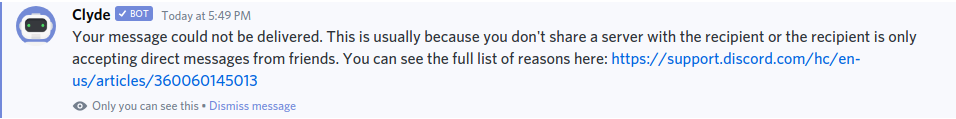
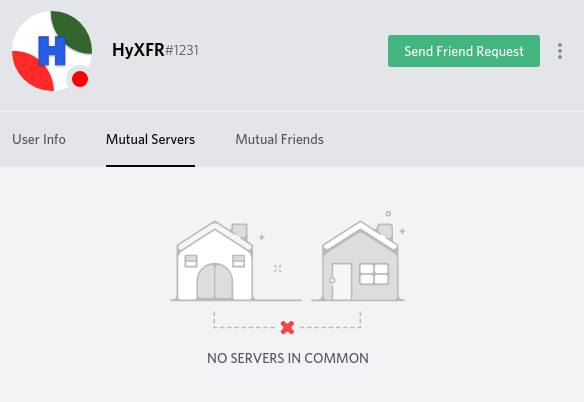
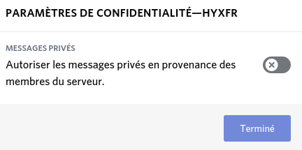
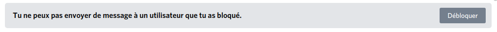

# Pourquoi un utilisateur ne peux pas être contacté ?

## Comment reconnaître un message qui n'a pas été envoyé ?

Quand un message que vous tenter d'envoyer ne s'envoie pas, pour raison ou pour une autre, vous recevrez un message dans ce style :

## Les raisons possibles

Plusieurs raisons sont possibles pour que ça arrive :

* Vous n'êtes pas dans le même serveur avec la personne que vous voulez contacter
* Vous avez désactiver les messages privés sur ce serveur
* Vous n'avez pas rempli les règles du serveur en question
* La personne que vous tenter de contacter n'autorise que les messages privés de ses amis
* Vous avez été bloqué par la personne que vous tenter de contacter

### Vous n'êtes pas sur le même serveur avec la personne que vous voulez contacter

Pour cette raison, il n'y a pas grand chose à expliquer, excepté que vous pouvez faire clique droit sur l'utilisateur &gt; Serveurs en Communs pour voir si vous êtes sur un de ses serveurs ou non.

### Vous avez désactiver les messages privés sur ce serveur

Sur un serveur, vous avez la possibilité d'enlever la possibilité d'être contacté en message privé, pour savoir ou modifier cela, effectuez un clique droit sur le serveur en question et cliquez sur "Privacy Settings" ou "Paramètre de confidentialité". Vous pouvez ensuite modifier cela à votre guise !

### Vous n'avez pas rempli les règles du serveur en question

Sur un serveur communautaire, il y a de fortes chances que la "Communauté" soit activée sur ce serveur en question, et qu'il y ai certaines règles à appliquer, pour savoir si il y en a sur un serveur, allez dans un salon, à l'endroit ou vous pouvez normalement envoyer des messages, il peut avoir marqué ceci :

Si il n'y a pas marqué ceci, ce n'est pas la raison de pourquoi vous ne pouvez pas le contacter. Si non, il suffit de cliquer sur le bouton "Terminer" et de suivre les indications.

### La personne que vous tenter de contacter n'autorise que les messages privés de ses amis

Dans ce cas, vous ne pouvez rien faire de votre coté, à part peut-être demander à la personne d'autoriser l'envoi de messages privés depuis le serveur, comme montré précédemment.

### Vous avez été bloqué par la personne que vous tenter de contacter

Quand vous avez été bloqué par la personne que vous tenter de contacter, Discord est censé vous afficher ceci dans le champ pour envoyer votre message

Mais, il se peut que ça ne s'affiche pas, et que Discord vous envoie un message, dans ce cas, essayez de rafraîchir Discord \(Controle + R si vous êtes sous Windows/Linux ou Windows + R si vous êtes sous Mac\), ou rafraîchissez directement votre page si vous êtes dans un navigateur.


Et voila ! Vous savez maintenant pourquoi un utilisateur ne peux pas vous contacter, si vous pensez qu'il manque quelque chose, n'hésitez pas à me contacter sur Discord.


